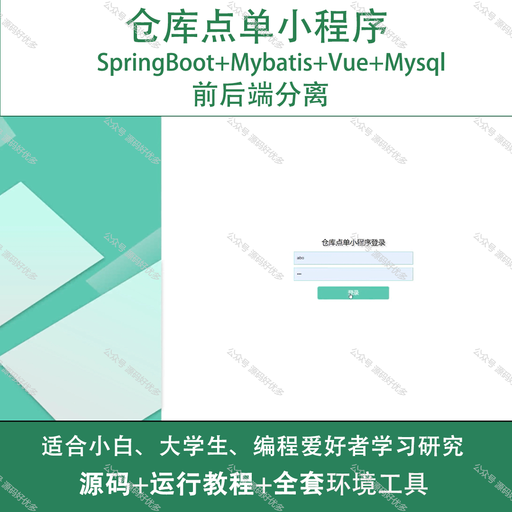
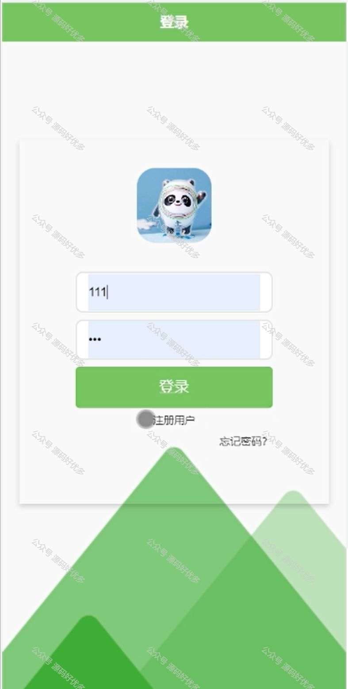
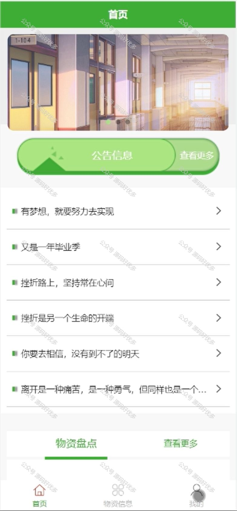
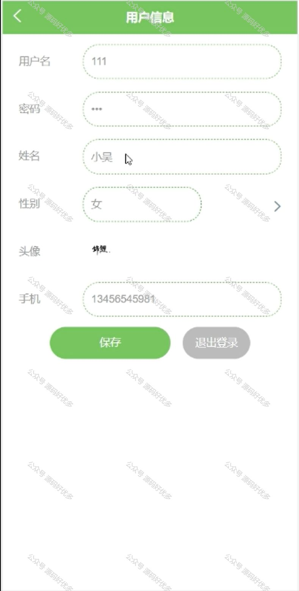
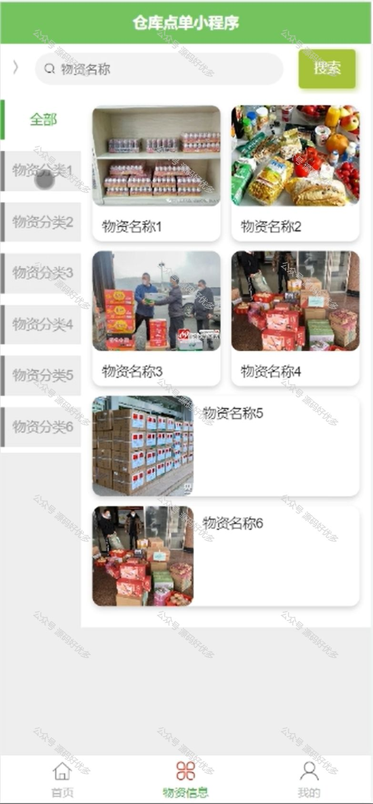
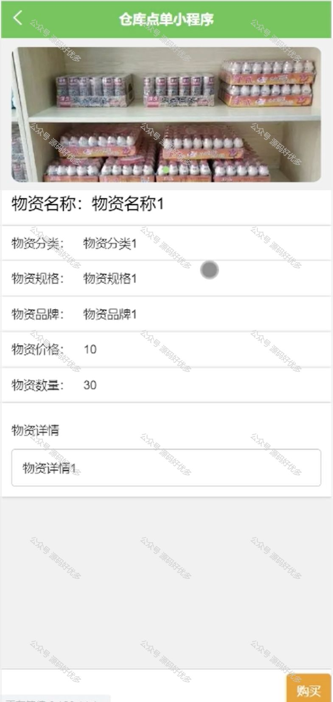
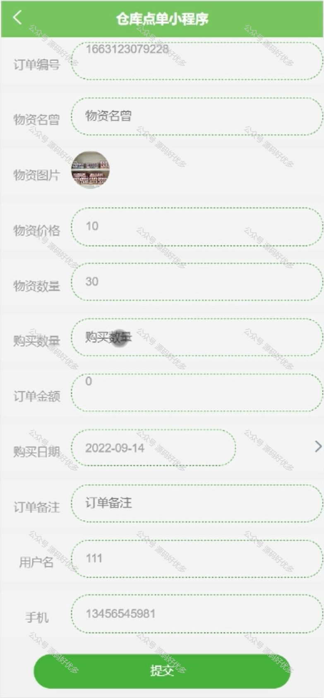
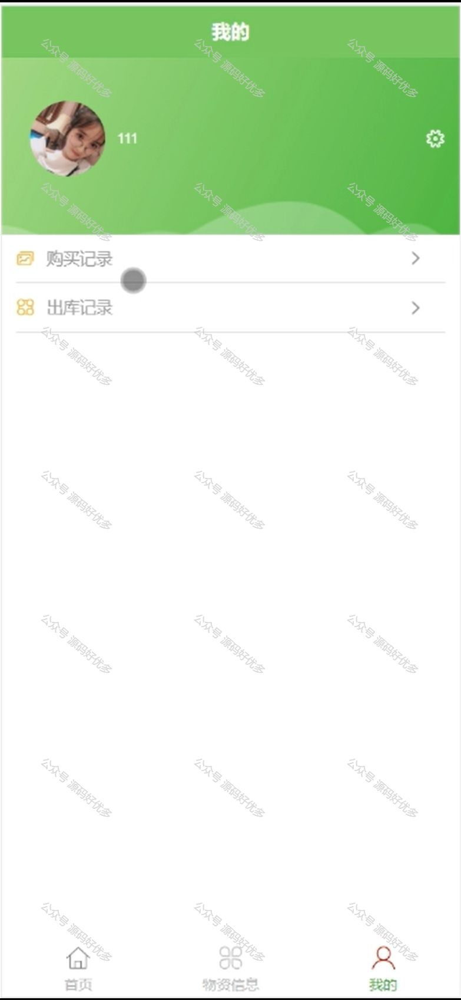
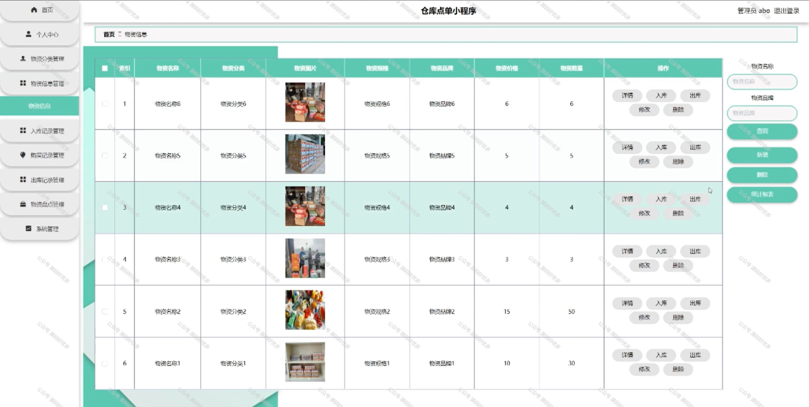
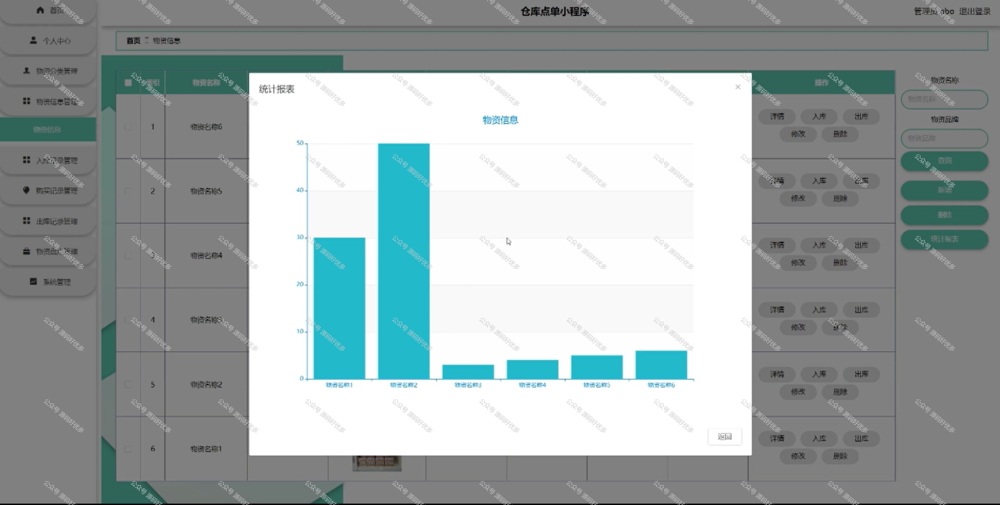

 
## 查看主页获取源码

> **作者介绍**： **✌**全网粉丝10W+本平台特邀作者、博客专家、CSDN新星计划导师、java领域优质创作者,博客之星、掘金/华为云/阿里云/InfoQ等平台优质作者、专注于项目实战 **✌**

  

### 一、作品包含

源码+数据库+全套环境和工具资源+部署教程

### 二、项目技术

前端技术：Html、Css、Js、Vue、Element-ui

数据库：MySQL

后端技术：Java、Spring Boot、MyBatis

  

### 三、运行环境

开发工具：IDEA/eclipse + 微信开发者工具

数据库：MySQL5.7

数据库管理工具：Navicat10以上版本

环境配置软件： JDK1.8+Maven3.6.3

前端Nodejs：14

### 四、项目介绍
项目编号：mpweixinA016

"仓库点单"小程序，是一款专为仓库管理设计的便捷工具。它以简化库存管理和提高点单效率为目标，实现了快速、准确的仓库点单流程。使用这款小程序，用户可以随时随地通过手机轻松完成仓库商品的点单工作，有效减少了传统点单过程中的繁琐步骤和时间浪费，提高了仓储作业的智能化和效率。

前台用户功能：登录注册、首页、物资信息、公告信息、个人中心、购买记录、出库记录

后台管理员的功能：首页、个人中心、物资分类管理、物资信息管理、入库记录管理、购买记录管理、出库记录管理、物资盘点管理、系统管理。

### 五、运行截图

  
